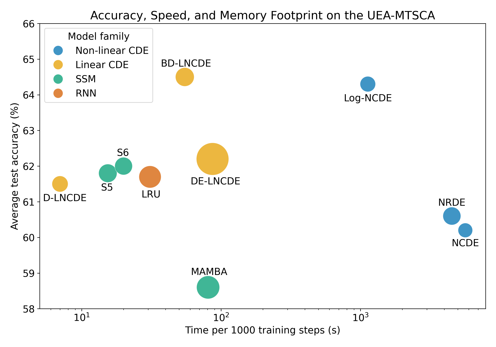

<h1 align='center'> Log Neural Controlled Differential Equations (ICML 2024)<br>
    [<a href="https://arxiv.org/abs/2402.18512">arXiv</a>] </h1>

Building on <a href="https://arxiv.org/abs/2009.08295">Neural Rough Differential Equations</a> (NRDEs), this
repository introduces Log Neural Controlled Differential Equations (Log-NCDEs), a novel, effective, and efficient 
method for training NCDEs. 

---

## Update – 22nd May 2025

This repository now supports **Structured Linear Controlled Differential Equations** (SLiCEs), which replace the non-linear vector fields of NCDEs and Log-NCDEs with structured linear vector fields, retaining the same maximal expressivity whilst being significantly more efficient.

SLiCEs are defined by

$$
h_t = h_0 + \int_0^t \sum_{i=1}^{d_X} A^i_{\theta} h_s \mathrm{d}X_s,
$$

where each $A^i_{\theta} \in \mathbb{R}^{d_h \times d_h}$ is a trainable matrix acting on the hidden state. When the $A^i_{\theta}$ are dense, this system is known as a **Linear Neural CDE (LNCDE)** and these models are *maximally expressive* (i.e., universal), see [here](https://github.com/Benjamin-Walker/selective-ssms-and-linear-cdes). However, the computational cost and number of parameters when using dense matrices scale as $\mathcal{O}(d_h^3)$, making them impractical for large models.

SLiCEs offer a solution: they retain the maximal expressivity **while reducing computational and memory costs** by structuring the $A^i_{\theta}$ matrices. This repository includes three SLiCE variants:
- **D-LNCDE**: Diagonal matrices: fastest, but limited expressivity.
- **BD-LNCDE**: Block-diagonal matrices: maximally expressive and efficient.
- **DE-LNCDE**: Fully dense matrices: maximally expressive, but computationally expensive.

**In practice**: Replacing the non-linear vector field of a Log-NCDE with the block-diagonal vector field of a BD-LNCDE leads to **20× faster training** per step on the UEA multivariate time-series tasks whilst achieving the same average test accuracy. The figure below compares models on their average test accuracy, average time per 1000 training steps, and average GPU memory, which is represented by the area of each circle.

<p align="center">
    
</p>

For further details and an expansive comparison with other state-of-the-art sequence models, see the [official SLiCE repository](https://github.com/Benjamin-Walker/structured-linear-cdes).

---

## Introduction

Neural controlled differential equations (NCDEs) treat time series data as observations from a control path $X_t$, 
parameterise a CDE's vector field using a neural network $f_{\theta}$, and take the solution path $h_t$ as a 
continuously evolving hidden state, 

$$h_t = h_0 + \int_0^t f_{\theta}(h_s) \mathrm{d}X_s.$$

Log-NCDEs use the Log-ODE method to approximate the solution path $h_t$ during training. Given a set of intervals 
$[r_i,r_{i+1}]$, the Log-ODE method replaces the CDE on each interval with the ODE, 

$$h_{r_{i+1}} = h_{r_i} + \int_{r_i}^{r_{i+1}}\bar{f}\_{\theta}(h_s)\frac{\log(S^{N}(X)\_{[r_i,r_{i+1}]})}{r_{i+1}-r_i}\mathrm{d}s,$$

where $\bar{f_{\theta}}$ is constructed using the iterated Lie brackets of $f_{\theta}$ and 
$\mathrm{log}(S^{N}(X)\_{[r_i,r_{i+1}]})$ is the depth $N$ truncated log-signature of X over $[r_i,r_{i+1}]$. Informally, 
$\bar{f}\_{\theta}$ is a high order description of the vector field $f_{\theta}$ and $\log(S^{N}(X)\_{[r_i,r_{i+1}]})$ 
is a high order description of the control path $X$ over $[r_i,r_{i+1}]$. This is shown schematically below, where the Log-NCDE's output
is a trainable linear readout $l_{\psi}$ of the hidden state and the system response is a potentially time varying label you
want to predict.

<p align="center">
    
</p>

---

## Getting Started

After setting up the JAX environment detailed in the next section, the best place to start is by exploring the `simple_example.ipynb` notebook. 
This Jupyter notebook provides a comprehensive example of training a NCDE and a Log-NCDE on a simple synthetic dataset. 
It serves as an example of how to apply the Log-ODE method during NCDE training. 

---

## Requirements

This repository is implemented in python 3.10 and most of the experiments use Jax as their machine learning framework. 
However, in order to use the efficient Pytorch implementation of the [Mamba recurrence](https://github.com/state-spaces/mamba/tree/main), 
the code for S6 and Mamba is implemented in Pytorch. Although it is possible to install the cuda versions of Jax and 
Pytorch in the same environment, we recommend using two separate environments. The repository is designed such that the
Jax environment is the main environment and the Pytorch environment is only used for the S6 and Mamba experiments.

### Jax Environment

The code for preprocessing the datasets, training S5, LRU, NCDE, NRDE, and Log-NCDE, and plotting the results uses the following packages:
- `jax` and `jaxlib` for automatic differentiation.
- `equinox` for constructing neural networks.
- `optax` for neural network optimisers.
- `diffrax` for differential equation solvers.
- `signax` for calculating the signature.
- `roughpy` for calculating the Hall basis.
- `sktime` for handling time series data in ARFF format.
- `tqdm` for progress bars.
- `matplotlib` for plotting.
- `pre-commit` for code formatting.

```
conda create -n Log-NCDE python=3.10
conda activate Log-NCDE
conda install pre-commit=3.7.1 sktime=0.30.1 tqdm=4.66.4 matplotlib=3.8.4 -c conda-forge
# Substitue for correct Jax pip install: https://jax.readthedocs.io/en/latest/installation.html
pip install -U "jax[cuda12]" "jaxlib[cuda12]" equinox==0.12.2 optax==0.2.4 diffrax==0.7.0 signax==0.1.1 roughpy==0.2.0
```

If running `data_dir/process_uea.py` throws this error: No module named 'packaging'
Then run: `pip install packaging`

After installing the requirements, run `pre-commit install` to install the pre-commit hooks.

### PyTorch Environment

The code for training S6 and Mamba uses the following packages:
- `pytorch` for automatic differentiation.
- `causal-conv1d` for the efficient implementation of a 1D causal convolution.
- `mamba-ssm` for the Mamba layer.
- `einops` for reshaping tensors.

```angular2html
conda create -n pytorch_mamba python=3.10
conda activate pytorch_mamba
conda install pytorch=2.2.2 pytorch-cuda=12.1 numpy=1.26.4 -c pytorch -c nvidia
conda install packaging=24.1 -c conda-forge
pip install causal-conv1d>=1.2.0 mamba-ssm==1.2.2 einops==0.8.0 jax==0.4.30
```

---

## Data

The folder `data_dir` contains the scripts for downloading data, preprocessing the data, and creating dataloaders and 
datasets. Raw data should be downloaded into the `data_dir/raw` folder. Processed data should be saved into the `data_dir/processed`
folder in the following format: 
```
processed/{collection}/{dataset_name}/data.pkl, 
processed/{collection}/{dataset_name}/labels.pkl,
processed/{collection}/{dataset_name}/original_idxs.pkl (if the dataset has original data splits)
```
where data.pkl and labels.pkl are jnp.arrays with shape (n_samples, n_timesteps, n_features) 
and (n_samples, n_classes) respectively. If the dataset had original_idxs then those should
be saved as a list of jnp.arrays with shape [(n_train,), (n_val,), (n_test,)].

### The Toy Dataset

The toy dataset consists of $100{,}000$ paths, with dimension $6$ and $100$ regularly spaced samples. For every
time step, the change in each channel is a sample from a standard normal distribution
rounded to the nearest integer. The signature is saved as a label, such that specific terms
can be choosen for the four classifications considered. The data can be generated by running
`data_dir/toy_dataset.py`.


### The UEA Datasets

The UEA datasets are a collection of multivariate time series classification benchmarks. They can be downloaded by 
running `data_dir/download_uea.py` and preprocessed by running `data_dir/process_uea.py`.

### The PPG-DaLiA Dataset

The PPG-DaLiA dataset is a multivariate time series regression dataset,
where the aim is to predict a person’s heart rate using data
collected from a wrist-worn device. The dataset can be downloaded from the 
<a href="https://archive.ics.uci.edu/dataset/495/ppg+dalia">UCI Machine Learning Repository</a>. The data should be 
unzipped and saved in the `data_dir/raw` folder in the following format `PPG_FieldStudy/S{i}/S{i}.pkl`. The data can be
preprocessed by running the `process_ppg.py` script.

---

## Models

The scripts in the `models` folder implement a number of deep learning time series models in Jax, including NCDEs, 
NRDEs, Log-NCDEs, LRU, and S5. In order to be integrated into the training, 
the `__call__` function of the model should only take one argument as input. In 
order to handle this, the dataloaders return the model's inputs as a list, 
which is unpacked within the model `__call__`. 

NCDEs and NRDEs are implemented in `models/NeuralCDEs.py`. Log-NCDEs are implemented in
`models/LogNeuralCDEs.py`. The models folder also contains implementations of the following
baseline models:
- `RNN`: A simple recurrent neural network which can use any cell. Currently,
the available cells are `Linear`, `GRU`, `LSTM`, and `MLP`.
- `LRU`: A stacked recurrent model with linear recurrent unit layers.
- `S5`: A stacked recurrent model with S5 layers.

The `torch_experiments` folder contains Pytorch implementations of S6 and Mamba. The [mamba-ssm](https://github.com/state-spaces/mamba/tree/main) package is 
used for the mamba recurrence and the S6 recurrence is implemented in `torch_experiments/s6_recurrence.py`.

---

## Experiments

The code for training and evaluating the models is contained in `train.py` for the jax models and
`torch_experiments/train.py` for the pytorch models. Experiments can be run using the `run_experiment.py` script. This script requires you to specify the names of the models you want to train, 
the names of the datasets you want to train on, and a directory which contains configuration files. By default,
it will run the NCDE, NRDE, Log-NCDE, S5, and LRU experiments. If run with the --pytorch_experiment flag, it will run
the S6 and MAMBA experiments. The configuration files should be organised as `config_dir/{model_name}/{dataset_name}.json` and contain the
following fields:
- `seeds`: A list of seeds to use for training.
- `data_dir`: The directory containing the data.
- `output_parent_dir`: The directory to save the output.
- `lr_scheduler`: A function which takes the learning rate and returns the new learning rate.
- `num_steps`: The number of steps to train for.
- `print_steps`: The number of steps between printing the loss.
- `batch_size`: The batch size.
- `metric`: The metric to use for evaluation.
- `classification`: Whether the task is a classification task.
- `lr`: The initial learning rate.
- `time`: Whether to include time as a channel.
- Any specific model parameters. 

See `experiment_configs/repeats` for some examples.

---

## Reproducing the Results

The configuration files for all the experiments with fixed hyperparameters can be found in the `experiment_configs` folder and
`run_experiment.py` is currently configured to run the repeat experiments on the UEA datasets for the Jax models.
The `results` folder contains a zip file of the output files from the UEA, PPG, and toy experiments. 
Furthermore, it contains the code for analysing the results and generating the plots in the paper.


---
## Update 28th October 2024

We discovered a minor error in the code that affected the optimiser used when training the models implemented in Jax. 
This bug has been fixed, and all experiments have been re-run. While this led to slight adjustments in the numerical 
results, the overall conclusions of the paper remain unchanged. The arXiv version of the paper has been updated to 
reflect these changes and can be found [here](https://arxiv.org/abs/2402.18512v3).


---

## Bibtex Citation

When using this code, please cite the following papers:

```bibtex
@article{Walker2024LogNCDE,
  title={Log Neural Controlled Differential Equations: The Lie Brackets Make a Difference},
  author={Walker, Benjamin and McLeod, Andrew D. and Qin, Tiexin and Cheng, Yichuan and Li, Haoliang and Lyons, Terry},
  journal={International Conference on Machine Learning},
  year={2024}
}


@misc{walker2025slices,
  title        = {Structured Linear CDEs: Maximally Expressive and Parallel-in-Time Sequence Models},
  author       = {Walker, Benjamin and Yang, Lingyi and Muca Cirone, Nicola and Salvi, Cristopher and Lyons, Terry},
  year         = {2025},
  month        = {May},
  url          = {https://arxiv.org/abs/2505.17761},
}
```
