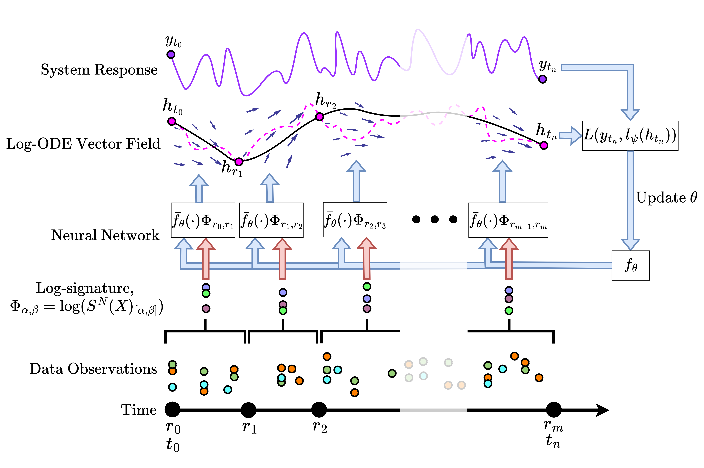

<h1 align='center'> Log Neural Controlled Differential Equations (ICML 2024)<br>
    [<a href="https://arxiv.org/abs/2402.18512">arXiv</a>] </h1>

Building on <a href="https://arxiv.org/abs/2009.08295">Neural Rough Differential Equations</a> (NRDEs), this
repository introduces Log Neural Controlled Differential Equations (Log-NCDEs), a novel, effective, and efficient 
method for training NCDEs. 

<p align="center">
    
</p>

Potentially irregular samples from a time series are transformed into the log-signature over a set of intervals 
$[r_i,r_{i+1}]$. The log-signature is combined with the iterated Lie brackets of a 

## Data

The data_dir folder contains the scripts for downloading data, preprocessing the data, 
generating path objects, and creating dataloaders and datasets. Raw data should be 
downloaded into the `data/raw` folder. Processed data should be saved into the `data/processed`
in the following format: 
```
processed/{collection}/{dataset_name}/data.pkl, 
processed/{collection}/{dataset_name}/labels.pkl,
processed/{collection}/{dataset_name}/original_idxs.pkl (if the dataset has original data splits)
```
where data.pkl and labels.pkl are jnp.arrays with shape (n_samples, n_timesteps, n_features) 
and (n_samples, n_classes) respectively. If the dataset had original_idxs then those should
be saved as a list of jnp.arrays with shape [(n_train,), (n_val,), (n_test,)].

### The Toy Dataset

The toy dataset consists of $100{,}000$ paths, with dimension $6$ and $100$ regularly spaced samples. For every
time step, the change in each channel is a sample from a standard normal distribution
rounded to the nearest integer. The signature is saved as a label, such that specific terms
can be choosen for the four classifications considered. The data can be generated by running
`data_dir/toy_dataset.py`.


### The UEA Datasets

The UEA datasets are a collection of multivariate time series classification benchmarks. They can be downloaded by 
running `data_dir/download_data.py` and preprocessed by running `data_dir/process_uea.py`.

### The PPG-DaLiA Dataset

The PPG-DaLiA dataset is a multivariate time series regression dataset,
where the aim is to predict a person’s heart rate using data
collected from a wrist-worn device. The dataset can be downloaded from the 
<a href="https://archive.ics.uci.edu/dataset/495/ppg+dalia">UCI Machine Learning Repository</a>. The data should be 
unzipped and saved in the `data/raw` folder in the following format `PPG_FieldStudy/S{i}/S{i}.pkl`. The data can be
preprocessed by running the `process_ppg.py` script.

## Models

The scrips in the models folder are used to define the various deep learning
models used in the experiments. In order to be integrated into the training, 
the `__call__` function of the model should only take one argument as input. In 
order to handle this, the dataloaders return the model's inputs as a list, 
which is unpacked within the model `__call__`. 

NCDEs and NRDEs are implemented in `models/NeuralCDEs.py`. Log-NCDEs are implemented in
`models/LogNeuralCDEs.py`. The models folder also contains implementations of the following
baseline models:
- `RNN`: A simple recurrent neural network which can use any cell. Currently,
the available cells are `Linear`, `GRU`, `LSTM`, and `MLP`.
- `LRU`: A stacked recurrent model with linear recurrent unit layers.
- `S5` A stacked recurrent model with S5 layers.

## Experiments

The code for training and evaluating the models is contained in `train.py`.  The main method for running experiments 
is the `run_experiment.py` script. This script requires you to specify the names of the models you want to train, 
the names of the datasets you want to train on, and a directory which contain configuration files. The configuration
files should be organised as `config_dir/{model_name}/{dataset_name}.json` and contain the
following fields:
- `seeds`: A list of seeds to use for training.
- `data_dir`: The directory containing the data.
- `output_parent_dir`: The directory to save the output.
- `lr_scheduler`: A function which takes the learning rate and returns the new learning rate.
- `num_steps`: The number of steps to train for.
- `print_steps`: The number of steps between printing the loss.
- `batch_size`: The batch size.
- `metric`: The metric to use for evaluation.
- `classification`: Whether the task is a classification task.
- `lr`: The initial learning rate.
- `time`: Whether to include time as a channel.
- Any specific model parameters. 

See `experiment_configs/repeats` for some examples.

## Requirements

The code is written in Python 3.10 and uses the following packages:
- `jax` and `jaxlib` for automatic differentiation.
- `equinox` for constructing neural networks.
- `optax` for neural network optimisers.
- `diffrax` for differential equation solvers.
- `signax` for hyperparameter optimisation.
- `sktime` for handling time series data in ARFF format.
- `tqdm` for progress bars.
- `matplotlib` for plotting.
- `pre-commit` for code formatting.

```
conda create -n Log-NCDE python=3.10
conda activate Log-NCDE
conda install pre-commit=3.7.1 sktime=0.30.1 tqdm=4.66.4 matplotlib=3.8.4
# Substitue for correct Jax pip install: https://jax.readthedocs.io/en/latest/installation.html
pip install -U "jax[cuda12]" "jaxlib[cuda12]" equinox==0.11.4 optax==0.2.2 diffrax==0.5.1 signax==0.1.1
```

If process_uea throws this error: No module named 'packaging'
Then run: pip install packaging

After installing the requirements, run `pre-commit install` to install the pre-commit hooks.


## Bibtex Citation

```
@inproceddings{Walker2024LogNCDE,
  title={Log Neural Controlled Differential Equations: The Lie Brackets Make a Difference},
  author={Walker, Benjamin and McLeod, Andrew D. and Qin, Tiexin and Cheng, Yichuan and Li, Haoliang and Lyons, Terry},
  journal={International Conference on Machine Learning},
  year={2024}
}
```